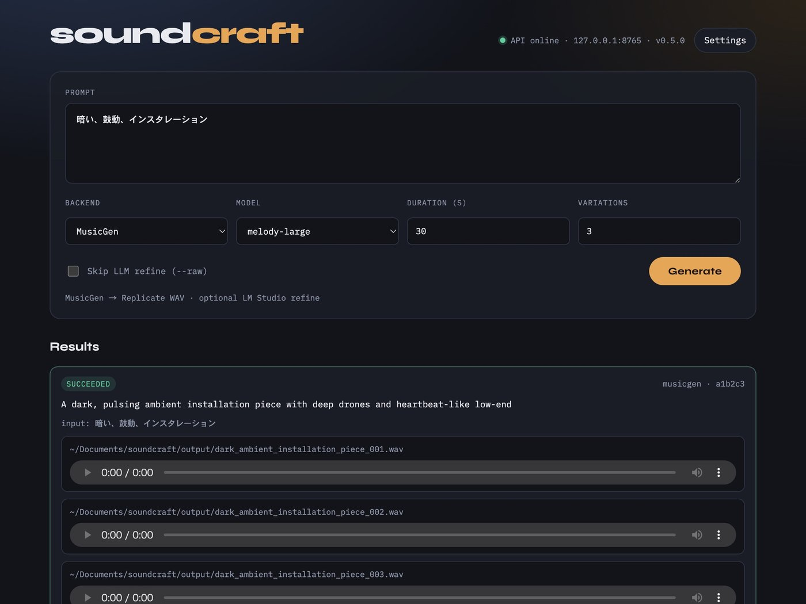

# soundcraft

[日本語](README.ja.md)

CLI, desktop app, local GUI, and API for generating instrumental music from text prompts via MusicGen and Lyria3.

```
Text → (optional) LM Studio refine → MusicGen or Lyria3 → audio files
```

<p align="center">
  
</p>

## For everyone (macOS app)

1. Download **Soundcraft-macos.zip** from [Releases](https://github.com/naotochan/soundcraft/releases)
2. Unzip and move `Soundcraft.app` to Applications (or anywhere you like)
3. **First launch only** (unsigned build): in Finder, **right-click** `Soundcraft.app` → **Open** → **Open** again in the dialog  
   (macOS Gatekeeper blocks unknown developers until you do this once; after that, double-click works)
4. In the app, open **Settings** and paste at least one API key:
   - [Replicate token](https://replicate.com/account/api-tokens) for MusicGen
   - [Gemini API key](https://aistudio.google.com/apikey) for Lyria3
5. Generate music — files go to `~/Documents/soundcraft/output/`

Keys are stored at `~/Library/Application Support/soundcraft/.env` (this Mac only).

## For developers (source)

```bash
git clone https://github.com/naotochan/soundcraft.git
cd soundcraft

uv venv
uv pip install -e .
source .venv/bin/activate

cp .env.example .env
# edit .env — or use Settings in the GUI / desktop app

soundcraft app          # desktop window (pywebview)
soundcraft gui          # browser UI
soundcraft serve        # API only (TouchDesigner, etc.)
soundcraft "暗い、鼓動、インスタレーション"
```

| Need | Command |
|------|---------|
| Desktop app window | `soundcraft app` |
| Browser GUI | `soundcraft gui` |
| API only | `soundcraft serve` |
| One-shot CLI | `soundcraft "…"` |

### Build the macOS `.app`

```bash
uv pip install -e ".[build]"
chmod +x scripts/build_macos_app.sh
./scripts/build_macos_app.sh
# → dist/Soundcraft.app and dist/Soundcraft-macos.zip
```

The zip is **not notarized**. Tell users about right-click → Open on first launch.

## `.env` (developers)

```
REPLICATE_API_TOKEN=your_token_here
GEMINI_API_KEY=your_gemini_api_key_here
LM_STUDIO_URL=http://localhost:1234
LM_STUDIO_MODEL=liquid/lfm2-24b-a2b
```

In desktop/app mode, Settings writes Application Support instead. LM Studio is optional (`--raw` / GUI toggle skips refine).

## CLI

```bash
soundcraft "暗い、鼓動、インスタレーション"
soundcraft "dark ambient drone, heavy reverb" --raw
soundcraft "energetic pop beat, bright" -b lyria3
soundcraft "glitch, metallic" -m stereo-melody-large -d 15 -n 5
```

| Flag | Description | Default |
|------|-------------|---------|
| `-b` | Backend: `musicgen`, `lyria3` | `musicgen` |
| `-m` | Model (MusicGen): `melody-large`, `stereo-melody-large`, `large`, `stereo-large` | `melody-large` |
| `-d` | Duration in seconds (MusicGen) | `30` |
| `-n` | Number of variations | `3` |
| `-o` | Output directory | `output/` (CLI) or `~/Documents/soundcraft/output/` (app) |
| `--raw` | Skip LLM prompt refinement | off |

## Local API

Same process as GUI / desktop app. Default: `http://127.0.0.1:8765`

| Method | Path | Description |
|--------|------|-------------|
| `GET` | `/` | Browser / embedded GUI |
| `GET` | `/health` | Liveness check |
| `GET` | `/settings` | Masked settings + paths |
| `PUT` | `/settings` | Save API keys / LM Studio |
| `POST` | `/settings/open-output` | Reveal output folder |
| `POST` | `/generate` | Sync generation |
| `POST` | `/jobs` | Async generation (best for TD) |
| `GET` | `/jobs/{id}` | Poll job |
| `GET` | `/media?path=` | Stream a generated file |

```bash
curl -X POST http://127.0.0.1:8765/jobs \
  -H 'Content-Type: application/json' \
  -d '{"prompt":"暗い、鼓動","backend":"musicgen","count":1}'
```

Response `files` are absolute paths (load in TD via `Audio File In CHOP`, etc.).

## Backends

| Backend | API | Output | Best for |
|---------|-----|--------|----------|
| MusicGen | Replicate | WAV | Ambient, experimental, dark textures |
| Lyria3 | Gemini | MP3 (30s clip) | Pop, bright, melodic |

## Output

```
~/Documents/soundcraft/output/…   # desktop app
./output/…                        # CLI / serve from a project folder
```

## Requirements

- macOS 12+ for the `.app` (or Python 3.10+ / [uv](https://docs.astral.sh/uv/) from source)
- [Replicate API token](https://replicate.com/account/api-tokens) (MusicGen)
- [Gemini API key](https://aistudio.google.com/apikey) (Lyria3)
- LM Studio (optional)
